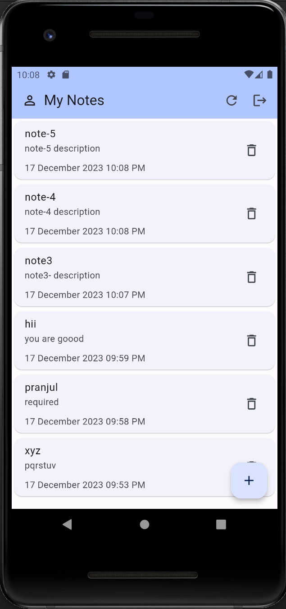

# noteapp

# Flutter Full Stack Note App

  

Welcome to the Flutter Full Stack Note App! This comprehensive note-taking application is designed with a full stack approach, utilizing the Flutter framework for the front end, and Express, TypeScript, MongoDB, Bloc Cubit State Management, and Shared Preferences for the back end. Users can seamlessly manage their notes, update their profiles, and perform various actions to organize their thoughts effectively.

Features
User Authentication: Securely sign up and sign in to access your notes. Your account is protected with industry-standard authentication mechanisms.

Profile Management: Users can easily update their profiles, ensuring that their information is always accurate.

Note Operations: Create, edit, and delete notes effortlessly. Keep your thoughts organized with the ability to perform a range of actions on your notes.

Bloc Cubit State Management: Utilizing Bloc Cubit architecture for efficient state management, ensuring a smooth user experience.

Shared Preferences: Local data persistence using Shared Preferences for seamless access to user preferences and data.

Technologies Used
Flutter: A UI toolkit for building natively compiled applications for mobile, web, and desktop from a single codebase.

Express.js: A fast, unopinionated, minimalist web framework for Node.js.

TypeScript: A superset of JavaScript that adds static typing to the language.

MongoDB: A NoSQL database that provides high performance, high availability, and easy scalability.

Bloc Cubit: A powerful state management library for Flutter applications.

Shared Preferences: A package to persistently store simple data in Flutter applications.
